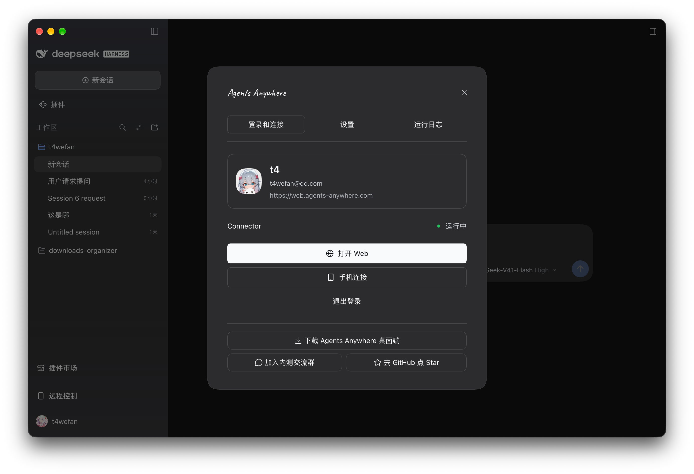
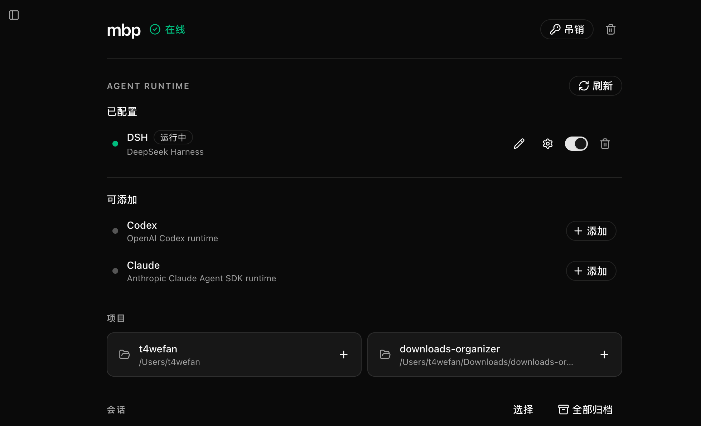

# Agents Anywhere for DSH

在 DeepSeek Harness（DSH）中连接 Agents Anywhere，从手机、平板或 Web 查看 DSH 会话、继续对话、回复提问和审批请求。Agent 仍在安装 DSH 的工作设备上运行；远程使用时，这台设备需要保持开机、联网，并让 DSH 与 Connector 正常运行。

插件随 **DSH Desktop** 提供，也可从 **npm** 安装到兼容的独立 DSH 环境。两种安装方式选其一；使用 DSH Desktop 时无需重复安装 npm 包。

## 可以做什么

- 在其他设备上查看 DSH 会话与运行进度，发送消息或继续已有会话。
- 根据 DSH 和当前会话的能力选择模型、权限与 Agent 模式，发送文字、图片或普通文件，回复输入请求与单次操作审批。
- 使用 Agents Anywhere Cloud 或自己的服务实例；在插件中查看连接状态、管理本机 Connector 和桥接日志。
- 如果 Agents Anywhere Desktop 正在运行，转到该应用完成连接；否则可以直接在插件中登录并连接本机设备。Agents Anywhere Desktop 和 DSH Desktop 是两个不同的应用。

## 在 DSH Desktop 中启用

DSH Desktop 已集成此插件，**不需要另行下载或执行 npm 安装命令**。在 DSH Desktop 的“插件”页面找到“远程控制”并启用，然后从左侧边栏“设置”上方打开“远程控制”。部分 Desktop 版本的开关位于“桌面设置”的“手机连接”区域；请以当前应用显示的入口为准。



首次使用时选择 Agents Anywhere Cloud，或输入自己部署的服务端地址，然后在浏览器中完成登录和授权。按照页面引导添加 Agent，并按需连接手机。若插件检测到 Agents Anywhere Desktop 正在运行，会引导你到该应用继续设置，避免两个应用同时管理同一台工作设备的连接。

插件随 DSH Desktop 一同打包和更新；请通过 Desktop 的发布渠道升级，不要对内置插件叠加独立 npm 安装。

## 从 npm 安装到独立 DSH

如果使用独立安装的 DSH，可以通过官方插件命令从 npm 安装。先确认目标 Profile 的名称，以及当前 npm 包声明的 DSH 依赖是否与你的环境相容。下面以 `desktop` Profile 为例：

```bash
dsh plugin --profile desktop add @agents-anywhere/dsh-bridge-next
```

安装完成后重启对应的 DSH 实例，从左侧边栏打开“远程控制”，按提示登录并连接。若你的 Profile 不是 `desktop`，请替换命令中的 Profile 名称。

安装命令不锁定插件版本，会获取 npm 当前的默认发布版本。插件包与 DSH 的兼容范围请以所安装版本的 `peerDependencies` 为准；较新的 DSH 不代表旧插件包自动兼容。当前仓库源码声明支持 DSH `0.2.0-rc.1` 及之后的 0.2.x 版本（peer 范围 `>=0.2.0-rc.1 <0.3.0-0`），开发与测试基线为 `0.2.0-rc.2`。DSH 在安装和启动插件时都会按这个范围检查，不满足时拒绝安装或跳过加载；DSH Desktop 使用与自身版本配套的内置构建，不能简单等同于 npm 上的包。需要固定可复现的部署时，再在包名后添加经过验证的版本号。

## 确认 DSH 已接入

完成连接后，在 Agents Anywhere 的设备页面可以看到设备在线，以及 DSH 运行时的状态。下图展示了 DSH 正在运行的设备；如果状态未出现或显示断开，先检查工作设备上的 DSH 和 Connector。



## 使用条件与数据范围

- 远程连接需要 Agents Anywhere 账号和可访问的服务端。自托管时输入后端地址；手机扫码时，手机也需要能够访问该服务。
- 会话、时间线和附件等数据会按所用功能经过或保存在 Agents Anywhere Server；自托管时由你部署的服务处理。模型账号与费用遵循所用模型服务的规则。
- 账号与设备凭据保存在本机插件数据目录，不放入页面跳转 URL。设备凭据失效或设备被删除时，插件会提示重新连接或创建，不会静默注册新设备。
- 如果 DSH 原生历史读取失败，对应会话的历史可能无法同步；其他会话仍可工作。在“桥接日志”中查看原因，修复原生历史后重试。插件不会自行修改 DSH 会话文件。

## 开发与进一步阅读

本仓库源码和 npm 已发布包可能处于不同版本。源码构建、链接安装、headless 检查、配置和实现细节见[技术说明](https://github.com/anywhere-labs/Agents-Anywhere/blob/main/dsh-bridge-next/TECHNICAL.md)。

[开发计划](https://github.com/anywhere-labs/Agents-Anywhere/blob/main/dsh-bridge-next/DEVELOPMENT_PLAN.md) · [Onboarding 方案](https://github.com/anywhere-labs/Agents-Anywhere/blob/main/dsh-bridge-next/ONBOARDING_PLAN.md) · [验证记录](https://github.com/anywhere-labs/Agents-Anywhere/blob/main/dsh-bridge-next/VERIFICATION.md) · [Agents Anywhere 使用文档](https://github.com/anywhere-labs/Agents-Anywhere/blob/main/docs/README.md)
